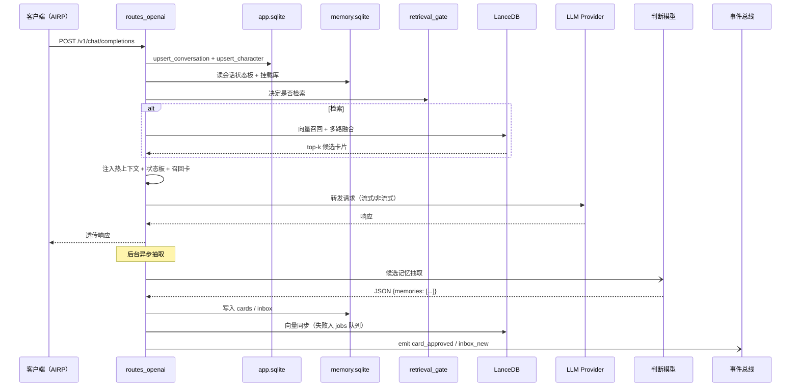

# KokoroMemo 项目设计文档

本文面向开发者和深度用户，记录架构、数据结构、内部流程和降级策略。面向普通用户的安装、接入、功能介绍和常见问题放在 `README.md`。

## 1. 总体架构

KokoroMemo 是一个本地化 AI 长期记忆代理，以 OpenAI-compatible 透明代理形式部署在用户的 AIRP 客户端和真实大模型之间。

```text
┌───────────────────┐      ┌──────────────────────────────────────────┐      ┌───────────────┐
│  AIRP 客户端       │─────▶│  KokoroMemo 本地代理                      │─────▶│  真实聊天模型   │
│  (SillyTavern等)  │◀─────│  127.0.0.1:14514                         │◀─────│  (Cloud LLM)  │
└───────────────────┘      └──────────────────────────────────────────┘      └───────────────┘
                                         │
                            ┌────────────┼────────────────┐
                            ▼            ▼                ▼
                       SQLite        LanceDB         填表/判断 LLM
                    (记忆本体)     (语义索引)        (便宜快速模型)
```

### 技术栈

| 层 | 技术 |
|---|---|
| 后端 | Python 3.11+ / FastAPI / uvicon / SQLAlchemy / aiosqlite |
| 向量存储 | LanceDB（file 模式）/ pgvector（server 模式） |
| 前端 | Vue 3 / TypeScript / Naive UI / vue-i18n |
| Web UI | 后端直接 serve Vue 静态文件 |
| 数据库 | SQLite（file 模式） / PostgreSQL + pgvector（server 模式） |
| 运行时 | Docker + Docker Compose（标准部署） |

### 部署模式

| 模式 | 数据库 | 向量存储 | 适用场景 |
|---|---|---|---|
| **file**（默认） | SQLite | LanceDB | `docker run` 单容器，零依赖 |
| **server** | PostgreSQL | pgvector | `docker compose up`，生产级 |

由 `KOKOROMEMO_DB_URL` 环境变量切换，未设置时自动使用 file 模式。

### 端口

| 端口 | 用途 |
|---|---|
| `14514` | 主 API（OpenAI-compatible 代理 + Admin API + WebSocket + Web UI） |
| `5173` | 前端开发服务器（`npm run dev`） |

后端同时服务 API 和 Vue 前端静态文件，统一监听 `14514`。

端口策略：
- `server.port` 是用户配置的期望监听端口（默认 `14514`）。
- Docker 环境下端口始终可用（容器独占网络隔离），不存在端口冲突。
- 容器内通过环境变量 `SERVER_PORT` 覆盖监听端口。

---

## 存储层设计

KokoroMemo 采用双存储模式设计：

- **file 模式**：SQLite + LanceDB，所有数据存储在容器挂载卷中（`/app/data/`）。
- **server 模式**：PostgreSQL + pgvector，通过 SQLAlchemy 统一访问。

存储层通过 `StorageRepository`（`app/storage/repository.py`）封装所有数据操作，业务代码只依赖仓库接口。

### 向量存储切换

```python
# file 模式 → LanceDB
# server 模式 → pgvector
store = get_vector_store(cfg)  # app/core/services.py
```

### 数据库迁移

- file 模式：启动时通过 legacy `init_*_db` 函数自动创建表结构。
- server 模式：通过 Alembic 管理 PostgreSQL 迁移。

---

## 角色中心设计

角色中心从“已发现角色展示页”升级为角色级策略管理入口，负责管理角色档案、默认会话策略、记忆库绑定和已有会话修复。

### 数据模型

`app.sqlite` 中角色相关表：

| 表 | 用途 |
|---|---|
| `characters` | 角色档案，包含 `display_name`、`aliases_json`、`notes`、`source`、最近更新时间等 |
| `character_defaults` | 角色默认会话策略，包含 `profile_id`、旧字段模板、表格模板、挂载预设、长期记忆写入策略、状态更新策略、注入策略、默认挂载库和写入库 |

新会话策略优先级：

```text
当前 conversation_config
  → 角色默认策略 character_defaults（auto_apply=true）
  → 全局新会话默认配置 conversation_default_config
  → 内置 fallback 方案
```

角色默认策略可批量应用到已有会话，后端会同步：

- `conversation_configs`
- `conversation_state_boards` 旧模板绑定
- `conversation_memory_mounts`

### API

| API | 用途 |
|---|---|
| `GET /admin/characters` | 获取角色档案、默认策略和会话统计 |
| `GET /admin/characters/{character_id}` | 获取单个角色详情 |
| `PUT /admin/characters/{character_id}` | 更新角色档案 |
| `GET /admin/characters/{character_id}/conversations` | 获取角色相关会话与会话策略 |
| `GET/PUT/POST /admin/characters/{character_id}/defaults` | 读取或保存角色默认策略 |
| `POST /admin/characters/{character_id}/apply-defaults` | 将角色默认策略应用到已有会话 |
| `GET /admin/characters/{character_id}/export` | 导出角色配置 |
| `POST /admin/characters/import` | 导入角色配置 |

---

## 2. 三层记忆架构

KokoroMemo 的核心设计决策是**分层记忆**，避免每轮都做昂贵的向量检索：

### 热记忆（Hot State）— 会话状态板

- **职责**：维护当前会话的实时上下文状态（场景、心情、任务、关系等）
- **存储**：v2 主路径使用 `state_table_rows` + `state_table_cells`；旧字段式 `conversation_state_items` 保留为兼容兜底
- **注入时机**：每轮请求前，渲染为文本注入系统提示词
- **更新时机**：每轮对话后，由 State Filler 模型自动更新
- **数据结构**：表格模板 → 表结构 → 行 → 单元格；旧结构为模板 → 标签页 → 字段
- **生命周期**：当前会话临时状态，不跨会话

### 温记忆（Card Graph）— 记忆卡片图谱

- **职责**：存储经审核的跨会话长期记忆
- **存储**：SQLite `memory_cards` + `memory_edges` 表
- **注入时机**：由 Retrieval Gate 按需触发
- **数据结构**：记忆卡片（typed, scoped, tagged） + 关系边（supports, constrains, contradicts, supersedes, elaborates, belongs_to, continues, same_as）
- **生命周期**：永久，可编辑/废弃/替代

### 冷记忆（Semantic Index）— 向量索引

- **职责**：为温记忆提供语义相似度检索入口
- **存储**：LanceDB 文件（file 模式）或 pgvector（server 模式），SQLite + numpy 兜底
- **特点**：可从 SQLite 完全重建，是索引而非数据本体
- **调用条件**：仅在 Retrieval Gate 判定需要时调用
- **降级**：`services.py` 在 `import lancedb` 失败时自动使用 `SqliteVectorStore`，API 完全兼容，暴力余弦搜索在 <5000 卡片下性能足够

---

## 3. 请求处理流程

```text
[1] 接收 POST /v1/chat/completions
        │
[2] request_parser: 解析 X-User-Id / X-Character-Id / X-Conversation-Id
        │
[3] upsert_conversation: 注册/更新会话记录
        │
[4] state_renderer: 读取并渲染当前会话状态板
[5] state_injector: 注入状态板到消息数组（system 消息后）
        │
[6] retrieval_gate: 判断是否需要长期记忆检索
        │  ├─ 触发条件: 新会话 / 关键词 / 周期刷新 / 低置信度
        │  └─ 跳过条件: 文本过短 / 状态板已充分
        │
[7] card_retriever (条件触发):
        │  ├─ Route 1: Pinned/boundary 卡片 (SQLite 直接)
        │  ├─ Route 2: 向量检索 (Embedding + LanceDB)
        │  ├─ Route 3: 最近重要卡片 (SQLite)
        │  └─ Route 4: 图扩展 (关系边遍历)
        │
[8] 可选 Rerank 重排序
[9] card_injector: 注入召回的记忆卡片
        │
[10] llm_providers: 转发到真实 LLM（支持 4 种 Provider）
[11] 流式/非流式返回响应
        │
[12] 后台异步任务:
        ├─ state_filler: 更新会话状态板字段
        └─ judge + card_extractor: 提取候选记忆 → 审核策略 → 入库/待审/拒绝
```

### 时序图（聊天补全请求）



---

## 3.5 实时事件总线（WebSocket）

后端 `/ws` 端点 + `app/core/events.py` 内存级 pub/sub，将关键事件实时推送到前端，无需轮询。

### 已实现事件

| 事件 | 触发点 | Payload |
|---|---|---|
| `card_approved` | `card_extractor.py` 自动批准并写入卡片时 | `{card_id, content, memory_type, importance}` |
| `inbox_new` | `card_extractor.py` 候选送入审核队列时 | `{card_id, content, memory_type, importance}` |

### 前端消费

`gui/src/components/EventBridge.vue` 全局组件：
- 应用启动时自动连接 `/ws`，断线后 5s 重连
- 收到事件后：① 触发 toast 通知（`inbox_new` 提示去审核、`card_approved` 提示已自动批准）；② 通过 `window.dispatchEvent('kokoromemo:event')` 派发，相关页面（Inbox、Dashboard）订阅并刷新数据

设计目标：避免页面 setInterval 轮询，提供更即时的响应反馈。

---

## 4. 模型分工

KokoroMemo 使用 4 种模型，各司其职：

| 模型 | 配置位置 | 类型 | 调用时机 | 职责 |
|---|---|---|---|---|
| 对话大模型 | `llm.*` | Chat | 每次请求 | 生成 AI 角色的回复 |
| 记忆判断模型 | `memory.judge.*` | Chat (cheap) | 每轮结束后 | 判断哪些内容值得写入长期记忆 |
| 状态板填表模型 | `memory.state_updater.*` | Chat (cheap) | 每轮结束后 | 更新当前会话的状态板字段 |
| 向量化模型 | `embedding.*` | Embedding | 检索时 + 入库时 | 文本向量化，语义检索 |

**Fallback 链**：State Filler → Judge → 主 LLM。用户可只配一个模型让三者共用。

---

## 5. 记忆提取与审核流水线

```text
对话完成
    │
    ▼
[Judge LLM] 分析 user + assistant 消息
    │
    ▼ 输出: JSON { memories: [...] }
    │
[过滤] importance < 0.45 → 丢弃
[过滤] confidence < 0.55 → 丢弃
    │
    ▼
[语义去重] Embedding 相似度 > 0.92 → 跳过
    │
    ▼
[审核策略 review_policy]
    ├─ 低风险 + 高置信 → auto_approve → 直接入库 + 向量同步
    ├─ 关系/边界变化 → pending → 进入收件箱等待用户审核
    └─ 助手单方面编造 → reject → 丢弃
    │
    ▼ (入库)
[SQLite] memory_cards 表
[LanceDB] vector_sync 向量同步
[WebSocket] 推送 card_approved / inbox_new 事件
```

### 离线导入路径

除了实时对话抽取，也可以从历史聊天日志批量提取候选记忆：

- `POST /admin/import/sillytavern` — 接收 SillyTavern 原生 JSONL 或 OpenAI 格式 JSONL，落地为一个 `conv_import_*` 会话
- `POST /admin/import/{conversation_id}/extract-memories` — 对该会话的 user/assistant 配对批量调用 `extract_and_route`（与上述抽取流水线相同），结果同样进入 inbox 等待审核

GUI 入口：记忆库页"导入 SillyTavern"按钮，导入完成后弹窗确认是否立即提取。

---

## 6. 数据存储设计

### SQLite 数据库

| 数据库 | 路径 | 内容 |
|---|---|---|
| app.sqlite | `./data/app.sqlite` | 用户、角色（首次对话懒插入）、会话注册、角色默认配置 |
| memory.sqlite | `./data/memory/memory.sqlite` | 记忆卡片、卡片版本（memory_card_versions）、收件箱、关系边、摘要、记忆库、挂载、状态板、检索决策 |
| chat.sqlite | `./data/conversations/{id}/chat.sqlite` | 逐会话对话日志 |

`memory.sqlite` 中状态板相关表：

| 表 | 用途 |
|---|---|
| `conversation_state_items` | 旧字段式状态项，兼容旧数据与旧渲染兜底 |
| `state_board_templates` / `state_board_tabs` / `state_board_fields` | 旧字段式状态板模板 |
| `conversation_state_boards` | 旧模板与会话绑定 |
| `conversation_configs` | 会话级方案、模板、挂载预设、长期记忆写入策略、状态更新策略和注入策略 |
| `conversation_default_config` | 新 conversation_id 首次出现时套用的默认会话策略 |
| `conversation_state_events` | 旧状态项事件 |
| `state_table_templates` | v2 表格模板，例如 `tpl_rimtalk_roleplay_tables` |
| `state_table_schemas` | v2 表定义、注入优先级、最大注入行数 |
| `state_table_columns` | v2 表列定义、是否注入、最大字符数 |
| `state_table_rows` | v2 会话级状态行 |
| `state_table_cells` | v2 状态行中的单元格值 |
| `state_table_events` | v2 行级手动编辑与模型操作事件 |
| `state_table_debug_runs` | v2 调试运行记录预留 |
| `retrieval_decisions` | Retrieval Gate 每轮决策记录 |

### LanceDB / SQLite 向量存储

| 路径 | 内容 |
|---|---|
| `./data/vector_indexes/{model}_{dim}/lancedb/` | LanceDB 向量索引（桌面端） |
| `./data/vector_indexes/{model}_{dim}/lancedb/vectors.sqlite` | SQLite 向量存储（LanceDB 不可用时自动创建） |

### 设计原则

- **SQLite 是数据本体**，LanceDB 是可重建索引
- **WAL 模式** + busy_timeout 保证异步并发安全
- **UNIQUE 约束**确保旧状态板同一会话、同一字段只有一个活跃状态项；v2 状态板以行 ID + 列 key 管理单元格
- **软删除**（status 字段）保留审计追踪
- **卡片版本表**（`memory_card_versions`）保留每次内容修改的历史快照，支持基于 `supersedes_card_id` 的卡片合并/替换

---

## 7. 前端架构

### 页面结构

| 路由 | 页面 | 职责 |
|---|---|---|
| `/dashboard` | Dashboard.vue | 服务状态、记忆系统统计、待审核数点击直达 |
| `/memories` | Memories.vue | 记忆卡片 CRUD、记忆库管理、SillyTavern 导入 |
| `/inbox` | Inbox.vue | 待审核候选记忆批准/拒绝（带备注） |
| `/state` | ConversationState.vue | 会话状态板管理（模板、标签页、字段） |
| `/characters` | Characters.vue | 已发现角色的默认状态板模板/挂载库绑定 |
| `/memory-graph` | MemoryGraph.vue | 记忆卡片关系图谱可视化（力导向布局） |
| `/settings` | Settings.vue | 全局配置（5 标签页：模型 / 记忆 / 状态填表 / 服务 / 高级） |

### 全局组件

- `EventBridge.vue` — 全局 WebSocket 事件桥；连接 `/ws`、自动 5s 重连、把 `card_approved` / `inbox_new` 事件转为 toast 通知 + 通过 window CustomEvent 派发给各页面触发自动刷新

### UI 设计原则

- 暗色主题（#0f0f11 背景，#18181b 卡片）
- 紫色主色调（#a78bfa）
- Naive UI 组件库统一风格
- 分区卡片布局：每个卡片职责单一
- 下拉菜单收纳低频操作，减少视觉噪音
- 所有确认操作使用 NPopconfirm + i18n 按钮文本
- 中英双语（vue-i18n）

### 设置页 5 标签页

| 标签 | 内容 |
|---|---|
| 模型配置 | 对话大模型、记忆判断模型、Embedding、Rerank |
| 记忆配置 | 长期记忆系统基础参数、向量索引维护（重建 / 异步迁移 / sync 重试） |
| 状态板填表 | 填表模型独立配置 |
| 服务配置 | 端口、时区、语言、关闭到托盘、更新检测 |
| 高级 | 记忆系统内部参数（左菜单 + 右面板布局）：会话自动检测、记忆总开关、注入作用域、抽取阈值、评分权重、检索门控、热上下文 14 段 |

每个高级配置分组配独立帮助按钮，弹窗逐字段说明含义、推荐值与典型场景。

---

## 8. 会话状态板设计

会话状态板负责维护“当前正在发生什么”，默认每轮注入到模型上下文。v0.6.0 起主路径为表格化状态板，旧字段式状态板保留为兼容兜底。

### v2 表格模型

```text
StateTableTemplate
  ├─ template_id, name, scenario_type, version, is_builtin
  └─ StateTableSchema[]
       ├─ table_id, table_key, name, prompt_priority, max_prompt_rows
       ├─ include_in_prompt, as_status, insert/update/delete/resolve rule
       └─ StateTableColumn[]
            ├─ column_id, column_key, name, value_type
            └─ required, include_in_prompt, max_chars, options

StateTableRow
  ├─ row_id, conversation_id, template_id, table_id, table_key
  ├─ status, priority, confidence, source, source_turn_id
  └─ StateTableCell[]
       └─ column_key, value, confidence
```

设计目标：

- 将“场景、角色、关系、规则、任务、事件、物品”拆成多张表，避免全部混在一个大文本字段。
- 以行作为最小更新单位，支持插入、更新、完成/删除和审计。
- 注入时按表优先级和每表最大行数压缩，控制上下文预算。
- 保留旧 `conversation_state_items`，便于读取历史数据和作为 v2 为空时的兜底。

### 会话策略与默认方案

状态板配置与状态数据分离。即使某个 `conversation_id` 还没有任何状态行，也可以先保存会话策略：

```text
ConversationConfig
  ├─ conversation_id
  ├─ profile_id
  ├─ template_id / table_template_id
  ├─ mount_preset_id
  ├─ memory_write_policy: disabled | candidate | stable_only | auto
  ├─ state_update_policy: disabled | manual | auto
  └─ injection_policy: none | memory_only | state_only | state_first | mixed
```

请求入口会先执行 `ensure_conversation_config(conversation_id)`：

1. 已有配置时直接使用。
2. 没有配置时读取 `conversation_default_config`。
3. 创建 `conversation_configs`，并同步旧字段模板绑定。
4. 后续注入、Retrieval Gate、State Filler 和长期记忆抽取都按该策略分流。

内置方案：

| profile_id | 适用场景 | 默认策略 |
|---|---|---|
| `airp_roleplay` | 普通角色扮演 / 陪伴聊天 | `mixed` 注入，长期记忆候选审核，状态板自动更新 |
| `rimtalk_colony` | RimTalk / 殖民地模拟 | `state_only` 注入，关闭长期记忆写入，状态板自动更新 |
| `ttrpg_story` | 跑团 / 剧情模拟 | `state_first` 注入，仅稳定设定进入长期记忆候选 |
| `memory_only` | 普通助手长期偏好记录 | 只注入和写入长期记忆 |
| `proxy_only` | 纯代理 | 不注入、不写记忆、不写状态 |

### 默认模板

普通角色扮演默认表格模板为 `tpl_rimtalk_roleplay_tables`，面向 RimTalk/连续角色扮演：

| table_key | 表名 | 用途 |
|---|---|---|
| `current_scene` | 当前场景 | 当前地点、时间、局面、焦点和下一步 |
| `character_state` | 角色状态 | 角色身份、情绪、身体/处境、短期目标和口癖 |
| `relationship_state` | 关系状态 | 用户与角色、角色之间的关系阶段和最近变化 |
| `roleplay_rules` | 扮演规则 | 用户明确要求保持的规则、边界、称呼和偏好 |
| `promises_tasks` | 承诺与任务 | 未完成承诺、命令、约定和短期任务 |
| `important_events` | 重要事件 | 影响后续的关键事件及其影响 |
| `important_items` | 重要物品 | 重要道具、证据、资源和归属 |

另有两个专用模板：

- `tpl_rimtalk_colony_tables`：殖民地概况、小人状态、小人关系、资源库存、建筑设施、威胁事件、阵营关系。
- `tpl_ttrpg_story_tables`：队伍成员、当前场景、任务线索、重要 NPC、地点阵营、剧情旗标。

`tpl_roleplay_light_tables` 作为轻量陪伴/RP 模板。

### 操作式填充流程

每轮对话完成后，非 `rule_only` 模式优先调用 `state_table_filler`：

1. 读取默认表格模板和当前会话已有状态行。
2. 构造系统提示词，列出可用表、列定义和已有行。
3. 将本轮用户消息与助手回复交给状态板填充模型。
4. 要求模型只返回严格 JSON。
5. 后端解析、校验 `table_key`、操作类型、列 key 和置信度。
6. 通过 `upsert_table_row` 更新 SQLite，并写入 `state_table_events`。
7. 若 v2 没有应用任何操作，可回退旧字段式 `fill_conversation_state`。

模型输出格式：

```json
{
  "operations": [
    {
      "op": "insert_row",
      "table_key": "relationship_state",
      "match": {},
      "values": {
        "subject": "用户",
        "object": "Yuki",
        "relationship": "互相信任的伙伴",
        "recent_change": "用户承诺下次继续一起调查"
      },
      "confidence": 0.86,
      "reason": "本轮明确改变了关系和后续承诺"
    }
  ]
}
```

支持的操作：

| op | 行为 |
|---|---|
| `insert_row` | 新增一行 |
| `update_row` | 根据 `row_id` 或 `match` 更新已有行 |
| `upsert_row` | 能匹配则更新，否则新增 |
| `resolve_row` | 将行标记为 resolved |
| `delete_row` | 当前实现同样标记为 resolved，保留审计 |

### 注入渲染

请求转发前，`routes_openai.py` 会优先读取 v2 表格状态：

1. 读取 `tpl_rimtalk_roleplay_tables`。
2. 读取当前会话 active 行和单元格。
3. `render_state_tables` 按 `prompt_priority`、`priority`、`confidence`、更新时间排序。
4. 每张表最多注入 `max_prompt_rows` 行。
5. 单元格按列 `max_chars` 截断。
6. 如果 v2 没有可渲染内容，回退旧 `render_state_board`。

渲染示例：

```text
【KokoroMemo 会话状态板】
当前会话状态板模板：RimTalk 角色扮演表格版。以下表格用于保持角色扮演、剧情与互动连续性：
【当前场景】
- 场景: 图书馆地下室；焦点: 两人正在寻找失踪档案；下一步: 检查上锁柜子
【扮演规则】
- 规则: Yuki 需要保持冷静但嘴硬的语气；范围: 全局
```

### GUI 与管理 API

GUI `/state` 是表格工作台：

- 输入 `conversation_id` 加载当前会话状态。
- 按表查看状态行数量和内容。
- 支持新增、编辑、删除行。
- 展示真实注入预览和字符预算。
- 支持手动输入一轮用户/助手消息运行表格填充调试。

主要 API：

| API | 用途 |
|---|---|
| `GET /admin/state/table-templates` | 列出 v2 表格模板 |
| `GET /admin/state/table-templates/{template_id}` | 查看完整 v2 表格模板 |
| `GET /admin/conversation-profiles` | 获取内置会话方案 |
| `GET /admin/conversation-defaults` / `PUT /admin/conversation-defaults` | 读取/保存新会话默认策略 |
| `GET /admin/conversations/{conversation_id}/config` | 读取当前会话策略，并返回旧 GUI 仍需要的挂载库、写入库、状态项数量和新会话标记 |
| `PUT /admin/conversations/{conversation_id}/config` / `POST /admin/conversations/{conversation_id}/config` | 保存当前会话策略；`POST` 为兼容入口，等价于 `PUT` |
| `GET /admin/conversations/{conversation_id}/state/tables` | 获取会话 v2 表格状态 |
| `POST /admin/conversations/{conversation_id}/state/tables/{table_key}/rows` | 新增或更新一行 |
| `DELETE /admin/state/table-rows/{row_id}` | 删除/完成一行 |
| `GET /admin/conversations/{conversation_id}/state/preview` | 获取真实注入预览 |
| `POST /admin/conversations/{conversation_id}/state/fill` | 手动运行 State Filler |

`GET /admin/conversations/{conversation_id}/config` 是新旧会话配置的合并摘要接口。返回值除 `ConversationConfig` 的 `profile_id`、`template_id`、`table_template_id`、`mount_preset_id`、`memory_write_policy`、`state_update_policy`、`injection_policy` 外，还必须包含：

| 字段 | 用途 |
|---|---|
| `mounted_library_ids` | 当前会话挂载的记忆库 ID 列表，兼容旧状态板和 GUI 读取逻辑 |
| `write_library_id` | 当前会话长期记忆写入目标库 |
| `mounts` | 完整挂载记录，包含是否写入目标等元数据 |
| `template_name` | 当前旧字段式状态板模板名称，用于兼容展示 |
| `state_item_count` | 当前会话旧字段式 active 状态项数量 |
| `is_new_session` | 判断是否仍是默认空会话，便于 GUI 提示用户先选择方案 |

`PUT/POST` 保存时同时接受 `library_ids` 与 `mounted_library_ids`，并根据 `write_library_id` 更新会话挂载，保证 v0.7 之后的新策略字段与旧挂载字段可以在同一个入口内保存。

### 旧字段式状态板兼容

旧结构仍存在：

```text
StateBoardTemplate
  ├─ StateBoardTab[]
  └─ StateBoardField[]
conversation_state_items
```

保留原因：

- 不破坏 v0.5.x 以前已有会话状态。
- 支持 `rule_only` 和旧投影逻辑。
- 当 v2 状态为空时仍可注入旧状态板。
- 后续可做显式迁移工具，而不是启动时自动破坏性迁移。

## 9. 检索门控（Retrieval Gate）

Retrieval Gate 是 v0.2.0 引入的优化机制，避免每轮都执行昂贵的向量检索。

### 决策逻辑

支持 4 种模式：

```python
if mode == "always": return True
if mode == "never": return False
if mode == "keyword_only":
    return contains_trigger_keywords(user_text)  # 仅关键词匹配时检索
# mode == "auto":
if is_new_session: return True
if contains_trigger_keywords(user_text): return True
if turn_number % vector_search_every_n_turns == 0: return True
if state_board_avg_confidence < threshold: return True
if len(user_text) < 4: return False
if state_is_sufficient: return False
return False
```

### 触发后执行

1. query_builder 从最近 N 轮对话构建检索查询
2. Embedding 模型向量化查询文本
3. LanceDB cosine 相似度搜索 top-K
4. 图扩展（遍历关系边获取关联卡片）
5. 加权评分（vector 55% + importance 20% + recency 10% + scope 10% + confidence 5%）
6. 可选 Rerank 重排序
7. 取 final_top_k 条注入

---

## 10. 发布与分发

### Docker 构建

KokoroMemo 采用 Docker 多阶段构建，前端在 Node 22 中预编译，最终产物为 Python 3.11-slim 运行时镜像。

```text
docker build -t kokoromemo:latest .
```

构建过程：

```text
Stage 1 (frontend): Node 22-alpine → npm ci → vite build → dist/
Stage 2 (final):    Python 3.11-slim → apt deps → pip install .[full] → 复制源码和前端产物
```

### 运行模式

**file 模式**（单容器，零依赖）：
```bash
docker run -d --name kokoromemo -p 14514:14514 \
  -v $(pwd)/config:/app/config -v $(pwd)/data:/app/data \
  kokoromemo:latest
```

**server 模式**（含 PostgreSQL + pgvector）：
```bash
docker compose up -d
```

### 升级与数据保护

- 用新镜像替换旧容器，挂载同一 data 目录即可升级。
- `docker compose pull && docker compose up -d` 自动拉取新镜像并重启。
- 数据始终保留在挂载卷中，容器销毁不影响数据。
- 升级前建议备份 `config/` 和 `data/` 目录。

---

## 10.5 错误处理与降级矩阵

KokoroMemo 强调"任何记忆系统失败都不影响聊天主链路"。下表列出关键失败场景及降级策略：

| 失败场景 | 触发位置 | 降级行为 | 用户可见影响 |
|---|---|---|---|
| LLM 上游超时 / 5xx | `proxy/llm_providers.py` | 直接把异常透传给客户端，不写记忆 | 客户端收到 502/超时；后续轮次正常 |
| 嵌入模型超时 / 失败 | `card_extractor` 抽取阶段 | 跳过本批向量同步，候选仍写入 SQLite，进入 `vector_sync` jobs 队列 | 候选可在审核页见到，召回时该卡暂不可用；可手动"重试失败的向量同步" |
| 嵌入模型超时 / 失败 | 召回查询阶段 | `card_retriever` 捕获异常并 `continue`，仅返回非向量路（pinned + recent + graph） | 召回质量下降但不中断 |
| Rerank 服务失败 | `card_retriever` 末尾 | 跳过 rerank，按打分排序直接取 `final_top_k` | 召回顺序略差 |
| 判断模型失败 | `card_extractor` 判断阶段 | 若开启 `extraction.fallback_rule_based` 则回退到正则规则；否则丢弃本轮候选 | 候选数减少 |
| LanceDB 索引损坏 / 维度不匹配 | `LanceDBStore.connect` | 启动时抛 `ValueError`，需要用户在设置页执行"重建向量索引" | 服务可启动但向量召回不可用 |
| 索引迁移中途失败 | `_run_index_migration` | 原子化策略：staging 表被 drop，老索引完整保留 | 用户在仪表盘看到 `failed` 状态，老索引继续工作 |
| 磁盘满 | SQLite 写操作 | aiosqlite 抛 `OperationalError`，调用方捕获并 log，候选丢失 | 服务降级；建议外部监控磁盘 |
| 数据库锁等待 | SQLite | `busy_timeout=5000` ms 后抛 `OperationalError`；上层捕获并 log | 偶发抖动 |
| WebSocket 连接断开 | 前端 `EventBridge.vue` | 5s 后自动重连；重连前页面回退到手动刷新 | 短暂无实时通知 |
| 配置文件损坏 | `load_config` | 启动失败，需要手动修复 YAML | 服务无法启动 |

设计原则：
- **静默降级**：能继续提供主功能就继续，不阻塞用户对话
- **可观察**：日志中必有 WARNING 或 ERROR 级别记录，方便排查
- **可恢复**：用户能在 GUI 内手动触发重试 / 重建（向量同步重试、索引重建等）

---

## 11. 设计决策记录

### 会话状态板 v2：表格化重构

状态板 v2 将旧的 `Template -> Tab -> Field` 字段填空模型升级为 `Table Template -> Table Schema -> Row -> Cell`：

- 模板层：`state_table_templates` 描述适用场景、内置状态和版本。
- 表结构层：`state_table_schemas` 与 `state_table_columns` 定义每张表的列、优先级、注入开关和最大注入行数。
- 数据层：`state_table_rows` 与 `state_table_cells` 保存会话级行状态，支持按行新增、更新、完成/删除。
- 审计层：`state_table_events` 记录手动编辑和模型操作，`state_table_debug_runs` 预留调试运行记录。
- 注入层：优先渲染表格状态；若表格为空，回退旧 `conversation_state_items` 渲染，保证兼容旧数据。

默认 `tpl_rimtalk_roleplay_tables` 包含当前场景、角色状态、关系状态、扮演规则、承诺与任务、重要事件、重要物品。State Filler v2 要求模型返回 JSON 操作列表，而不是自然语言总结或单字段大段文本，便于校验、合并和回滚。

### 为什么用 SQLite 而不是 PostgreSQL？

- 本地优先：用户不需要安装额外数据库服务
- 零配置：WAL 模式 + aiosqlite 即可满足并发需求
- 便携：单文件数据库，方便备份和迁移
- 性能足够：AIRP 场景下并发量低，SQLite 绰绰有余

### 为什么用 LanceDB 而不是 Milvus/Pinecone？

- 本地文件存储，不需要额外服务
- 轻量级，适合桌面应用嵌入
- 支持 cosine similarity，满足语义检索需求
- 可从 SQLite 完全重建，不是数据本体

### 为什么记忆判断和状态板填表分开？

- **产出不同**：一个产出长期记忆卡片，一个产出临时会话状态
- **故障隔离**：一个出错不影响另一个
- **提示词精简**：各自 prompt 专注自己的任务
- **Fallback 链共享**：可以只配一个模型让两者共用

### 为什么不直接把聊天记录放进向量库？

- AIRP 对话包含大量临时剧情、玩笑、误会
- 全量入库会导致记忆污染
- 记忆卡片形式支持审核、编辑、废弃、关系结构
- 用户可控比全自动更重要
